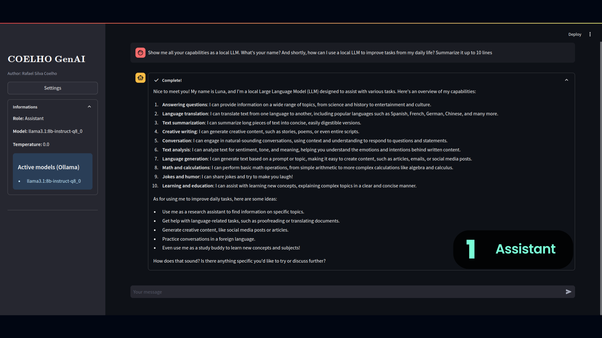
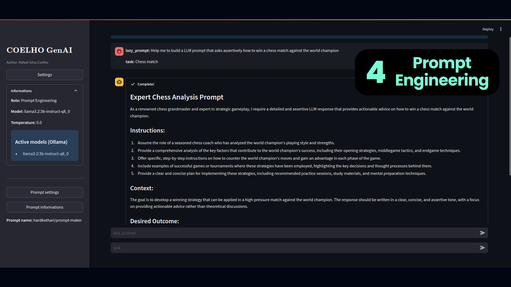

# COELHO GenAI

  
  
  
   
   
   
   

## How to install this project
1) Download Ollama on your machine: https://ollama.com/download  
2) Download any LLM model you want from Ollama (https://ollama.com/search) using the following command:
> ollama run MODEL_NAME  
3) Download Miniconda (for Anaconda environments): https://docs.anaconda.com/miniconda/
4) Clone this repository:  
> git clone https://github.com/rafaelcoelho1409/COELHOGenAI
5) Create a Conda environment:
> conda create --name coelhogenai_env python=3.12
6) Activate this Conda environment:
> conda activate coelhogenai_env
7) Install PIP on Conda:
> conda install pip
8) Install all requirements to run this project:
> pip install -r requeriments.txt
9) Finally, run the project:
> streamlit run app.py